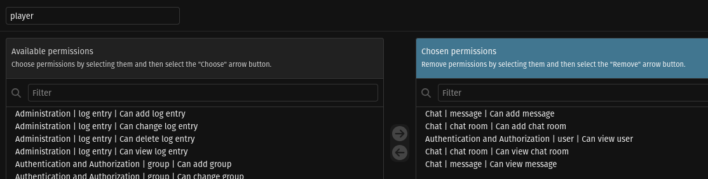
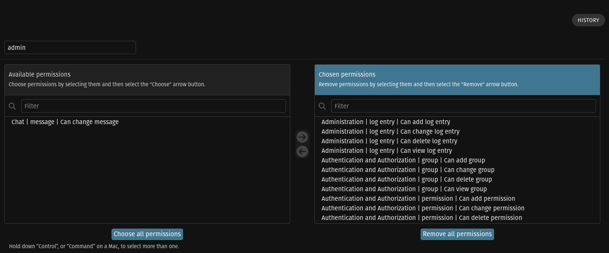

### Gestión de usuarios:
1.  Crear al menos 2 grupos distintos.
    Limitar el uso de los grupos que no sean administradores (Por ejemplo, hacer que los empleados no puedan borrar registros de algún modelo).

    1. Player
    Permisos bastante minimos
    

    1. Admin: Puede hacer todo menos cambiar mensajes de los usuarios, este es un compromiso de confianza.
    

### Tecnologias con Django

1. Implementar al menos 1 *viewset*.
    1. Los usuarios Staff tienen acceso a viewsets completos de chatrooms y mensajes

1. Utilizar al menos *4 vistas genéricas distintos para cada modelo*.
    1. Chatroom
        1. Cualquier jugador puede crear una
        1. Get my chatrooms, get all public chatrooms
        1. Modify chatroom, name or description
        1. Delete chatroom i am owner of
    1. Message
        1. Create Message
        1. Get sent messages by ME
        1. Edit message done by me
        1. Delete message done by me

1. Al menos un *api_view propia que enlace modelos* (que no sean vistas genéricas)
    1. ChatRoomStats: Numero de chatrooms de los que el usuario es propietario.

1. Implementar al menos dos modelos.
    1. Chatroom
        1. Owner Player/s
        1. Member players 
        1. Name
        1. Descripcion
    1. Message
        1. Author
        1. Date
        1. Chatroom
        1. Content (up to 255 chars)

### BBDD
1. importante explicar paso a paso como se ha hecho la migración, en caso de que la BBDD ya estuviese creada en sqlite.
    - En el archivo db_migration.db en esta carpeta

### Conclusiones y Observaciones

## Referencias usadas aparte de clases

https://www.django-rest-framework.org/api-guide/viewsets/
